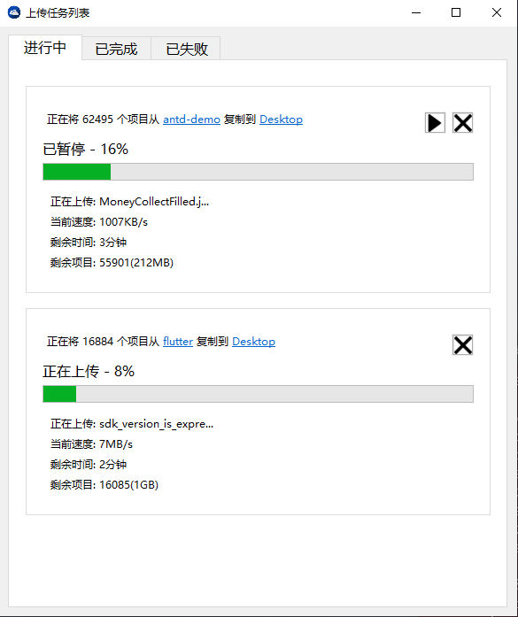

# smb-uploader
a local uploader program, used to be invoked by Web to upload big file and folder to smb server



## Features
 - [x] GUI support
 - [x] Suspend running task
 - [x] Resume running task
 - [x] Abort running task
 - [x] Http interface

## Build
Requires:
 - Windows10
 - Go > 1.6
 - GCCGO
```
windres -o resource.syso resource.rc
set GOARCH=386 # if x86 arch
set CGO_ENABLED=1
go build -ldflags="-H windowsgui"
```

## Getting Start
run `upload.exe`, then make a `POST` request to `http://127.0.0.1:8888`:
```
{
	"targetPath": "\\\\192.168.3.5\\Users\\A\\Desktop",
	"isDir": true,
}
```
`targetPath` is your target smb url (or you can test with a local path like `C:\Users\A\Desktop` without smb server)


## TODO List
 - [x] GUI support
 - [x] Suspend running task
 - [x] Resume running task
 - [x] Abort running task
 - [x] Http interface
 - [ ] Single process
 - [ ] Windows registry script 
 - [ ] Log modules
 - [ ] Recover task from error logs
